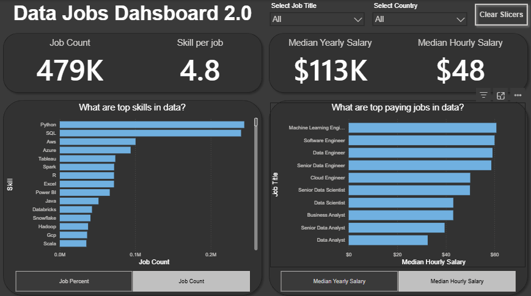

# My Power BI Dashboard Portfolio

Welcome to my collection of Power BI dashboards, where data is transformed into interactive and meaningful insights. Each project focuses on analyzing different datasets through data cleaning, modeling, visualization, and interactive reporting techniques.

This portfolio also reflects the evolution of my learning journey in Power BI, progressing from basic dashboards to more advanced and interactive analytical solutions. Each dashboard represents the development of new technical skills, design improvements, and deeper data analysis capabilities.

# Featured Dashboards

Explore a selection of Power BI dashboards that showcase different analytical approaches, visualization techniques, and business insights. Each project highlights practical applications of data transformation, interactive reporting, and dashboard design while reflecting the continuous growth of my Power BI and data analytics skills.

## Data Jobs Dashboard (V1 - Comprehensive Exploration)

**Key Skills Demonstrated**

* Data Cleaning & Transformation with Power Query
* Interactive Data Visualization Techniques
* KPI Creation and Data Aggregation
* User-Friendly Dashboard Design
* Interactive Reporting Experience
* Trend & Salary Analysis
* Geographical Data Representation
* Data Storytelling and Insight Presentation
* Business-Oriented Data Exploration
* Data Preparation for Accurate Reporting

[**View Full Project 1 Details (README)**](v1/README.md)

## Data Jobs Dashboard (V2 - Single Page Focus)

**Key Skills Demonstrated**

* Advanced Data Transformation with Power Query
* Relational Data Modeling
* DAX Measures and Business Calculations
* Multi-Chart Data Visualization
* Modern Dashboard Design & Visual Hierarchy
* Interactive User Experience Design
* Salary & Skills Market Analysis
* Single-Page Dashboard Architecture
* Insight-Driven Data Exploration
* Analytical Storytelling with Data

[**View Full Project 2 Details (README)**](v2/README.md)