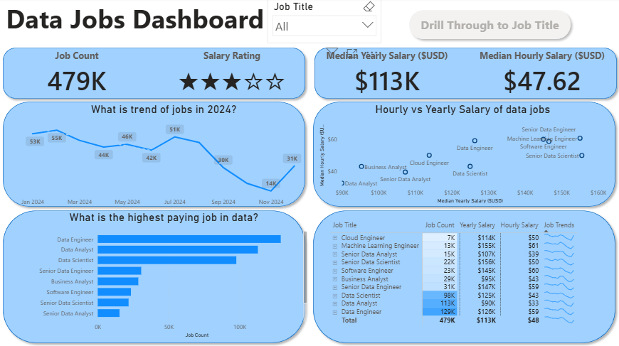
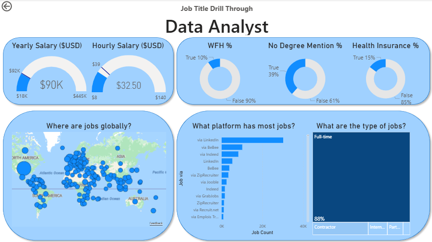

# Data Jobs Dashboard with Power BI

## Introduction

Interactive dashboard developed in **Power BI** to explore the 2024 data job market. It includes analysis of annual and hourly salaries, highest-paying jobs, global job distribution, remote work opportunities (WFH), job benefits, platforms with the most job postings, and the most in-demand roles in the data industry.

## Skills Showcased

- **Data Transformation with Power Query:**
Cleaned, transformed, and prepared raw datasets for analysis by handling missing values, formatting inconsistencies, and data structuring to ensure accurate reporting and visualization.
- **Implicit Measure:**
Created and utilized implicit measures in Power BI to perform quick aggregations and calculations, enabling efficient analysis and dynamic visualization of key metrics within the dashboard.
- **Core Charts:**
Designed interactive visualizations using core Power BI charts such as *bar charts*, *line charts*, *maps*, *cards*, and *tables* to effectively communicate trends, comparisons, and key insights from the data.
- **Dashboard Design:**
Developed a clean and user-friendly dashboard layout focused on readability, visual consistency, and intuitive navigation to enhance data exploration and decision-making.
- **Interactive reporting:**
Implemented interactive features such as slicers, buttons, and drill-through navigation to create a dynamic user experience and enable deeper exploration of the dashboard data.

## Dashboard Overview

### Page 1: High-Level Market View

Discover key insights into the 2024 data job market through an interactive overview of salaries, job opportunities, remote work trends, and global job distribution. The visualizations provide a clear snapshot of the industry, helping users quickly identify patterns and explore the current demand for data-related roles.

### Page 2: Job Title Drill Through

Explore detailed insights for specific data job roles, including salary trends, remote work availability, job distribution, and employment patterns across different regions. Interactive drill-through features make it easy to compare positions and better understand the dynamics of the data job market.

## Conclusion

This dashboard provides an interactive and data-driven overview of the 2024 data job market, helping users explore salary trends, job demand, remote work opportunities, and role-specific insights. By combining effective visualizations with interactive reporting features, the project transforms raw data into meaningful information that supports analysis and decision-making in the data industry.