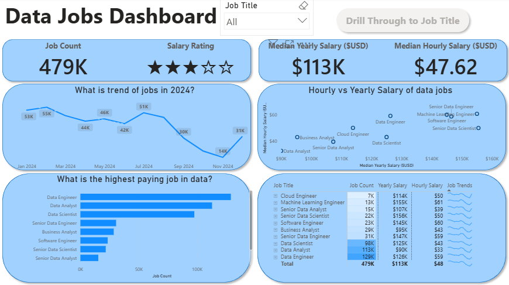
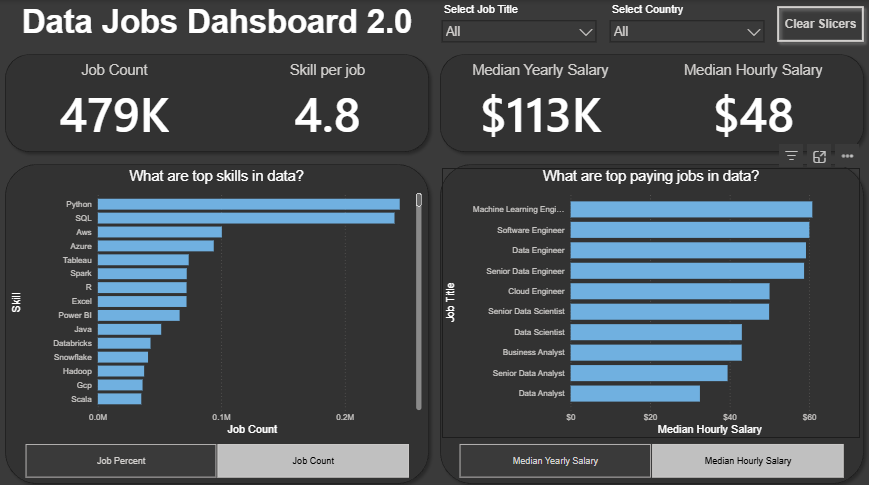

# Data Jobs Dashboard

Two versions of the same dashboard, analyzing the 2024 data job market (salaries, job distribution, remote work, top skills). V2 is a redo of V1 with a proper data model and DAX instead of a single flat table.

## V1 - Full Exploration

Multi-page dashboard built with Power Query cleaning and implicit measures: salary trends, job distribution, and a drill-through page by job title.

[View details](v1/README.md)

## V2 - Single Page

Redo of v1 with a real data model and DAX measures, condensed into a single page with slicers.

[View details](v2/README.md)
