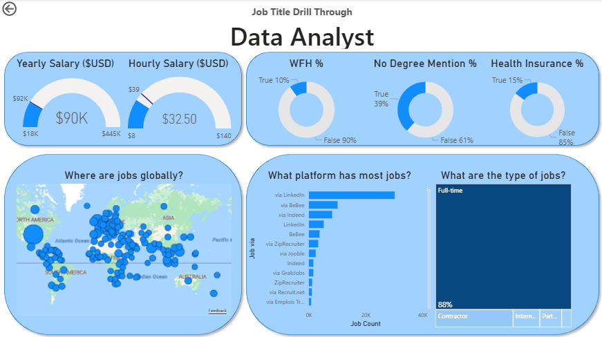

# Data Jobs Dashboard v1

## Overview

Power BI dashboard exploring the 2024 data job market: annual/hourly salaries, top-paying jobs, global job distribution, remote work, and most in-demand roles.

## Tools

- Power BI Desktop
- Power Query

## Skills

- Data cleaning and transformation with Power Query
- Implicit measures
- Core charts: bar, line, map, cards, tables
- Slicers and drill-through

## Pages

**Page 1 - Market overview** (shown above): salaries, job distribution, remote work trends.

**Page 2 - Job title drill through**

Drill through by job title to compare roles in detail.
