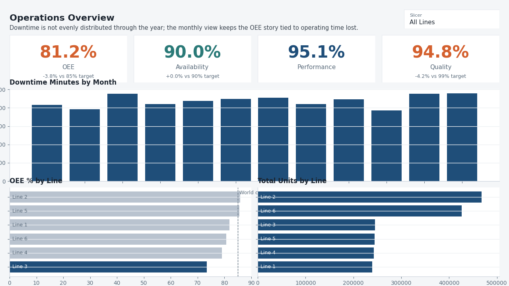
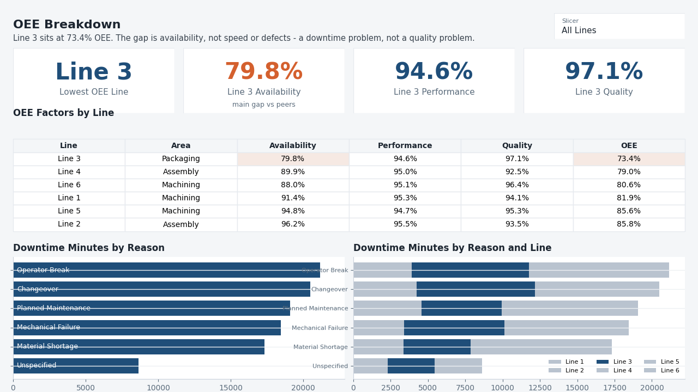
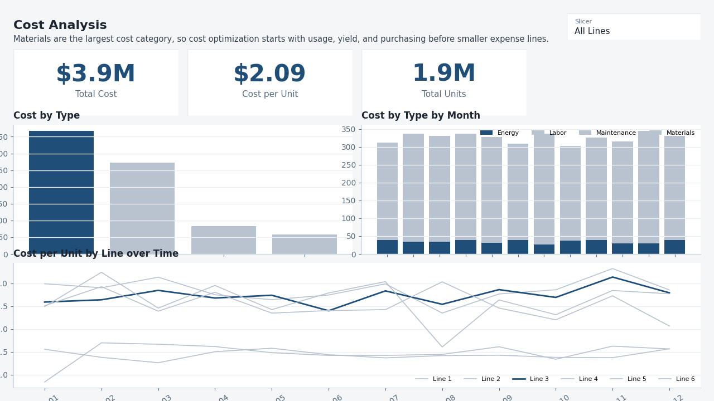

# Industry Operations & Cost Optimization - Power BI

Dashboard design built from the clean CSVs in [Python](../python), using the same portfolio design system as the Wastewater Effluent Quality dashboard: header band, single blue accent, neutral supporting visuals, KPI cards at the top, and one written finding per page.

## Tools

- Power BI Desktop
- Power Query
- DAX measures

## Pages

**Overview**

Headline OEE cards plus monthly downtime, OEE by line, and units by line. The page leads with the operating benchmark: average OEE is below the 85% world-class target.

**OEE Breakdown**

Line-level factor table for Availability, Performance, Quality, and OEE, followed by downtime by reason and downtime by reason/line. The main finding is that Line 3's gap is availability, not speed or defects.

**Cost Analysis**

Cost cards and visuals for cost type, cost type by month, and cost per unit by line over time. Materials are the largest cost category, so the cost story starts there.

## Power BI Build Notes

The model, DAX, page map, and formatting rules are documented in [dashboard_spec.md](./dashboard_spec.md).

## How to run

Open Power BI Desktop, import the clean CSVs from `industry_operations_cost/python/data/processed/`, apply the relationships and measures in [dashboard_spec.md](./dashboard_spec.md), and save the report as `industry_operations_cost.pbix`.

## Project Status

Done
