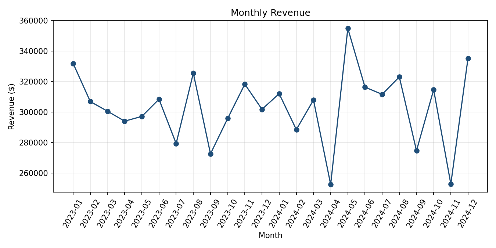
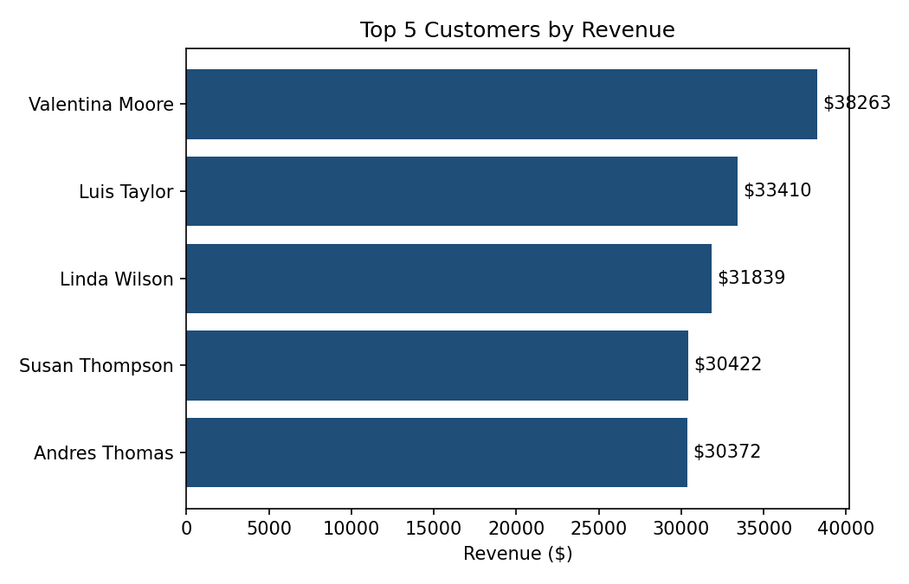

# Sales Analytics Pipeline - Excel Analysis

Analysis on top of the clean CSVs from [Python/sales_analytics_pipeline](../python), using formulas only.

Other parts: [Python](../python)

## Tools

- Microsoft Excel
- VLOOKUP, SUMIFS, COUNTIFS, LARGE, INDEX/MATCH

## Workbook (`sales_analysis.xlsx`)

- **Customers / Products / Orders**: the clean tables, imported as-is. `Orders` adds 3 VLOOKUP/TEXT columns (customer segment, product category, order month) - the Excel equivalent of the join the old SQL version used.
- **Monthly Revenue**: total revenue and orders per month, plus % growth vs the previous month (a plain reference to the row above, not a window function).
- **Top Customers**: top 5 customers by revenue - a helper table computes revenue for all 500 customers with SUMIFS, and `LARGE` + `INDEX/MATCH` pull out just the top 5.
- **Product Performance**: units sold, revenue, cost and profit per product, rolled up by category.
- **Segment Summary**: revenue and orders by customer segment.
- **Order Status**: order count and % breakdown by status.

## Findings

- ~$7.28M total revenue from 5,133 completed orders.
- Revenue was flat between 2023 ($3.63M) and 2024 ($3.65M).
- Software is the top category by revenue (~$2.39M), ahead of Electronics (~$1.91M).
- The three customer segments are almost tied in revenue (~$2.35M each).
- ~12.6% of orders end up Cancelled or Returned.




## How to run

Open `sales_analysis.xlsx` - all formulas recalculate automatically. To rebuild from scratch, regenerate the CSVs with the Python script and re-import them into the `Customers`/`Products`/`Orders` sheets.

Charts above are generated separately from the workbook data:

```bash
cd sales_analytics_pipeline/excel
pip install openpyxl matplotlib
python make_charts.py
```

## Project Status

🟢 Done
