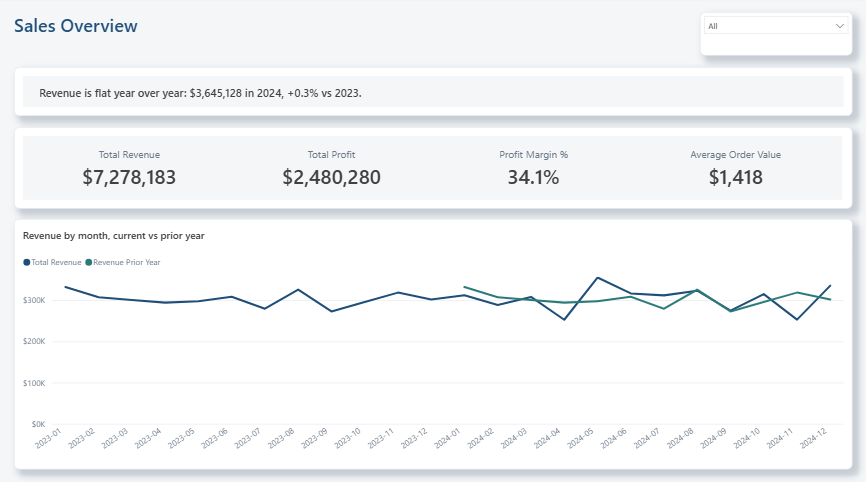
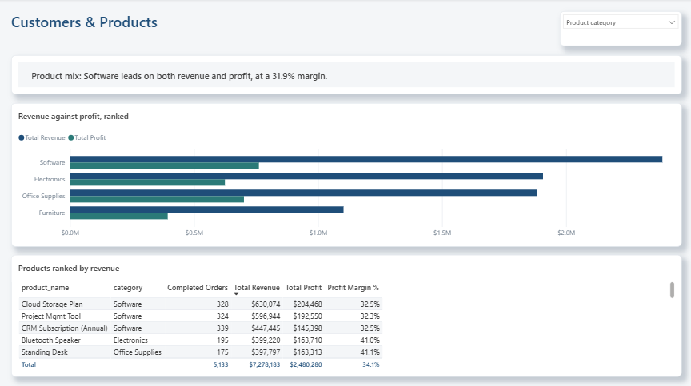
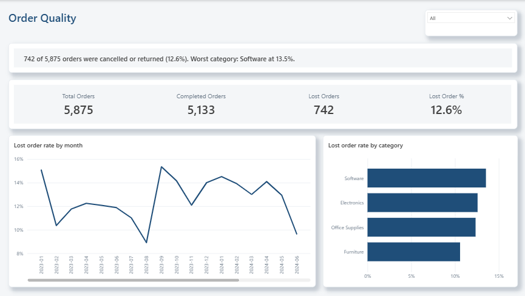

# Sales Analytics Pipeline - Power BI

Three-page report built on the clean CSVs from [Python](../python), sharing the portfolio grid, palette and theme with the other dashboards. Each page is laid out around the question it answers rather than reusing one template.

## Tools

- Power BI Desktop
- Power Query
- DAX measures, a field parameter, and narrative measures

## Data Model

A star schema: `orders` is the fact table, with `customers`, `products` and a generated `Date` table as dimensions. Measures live in a dedicated `_Measures` table rather than scattered across the fact table.

```DAX
Date = CALENDAR(MIN(orders[order_date]), MAX(orders[order_date]))
```

The Excel workbook is deliberately not a data source. It computes the same figures from the same CSVs, so importing it would create two sources of truth for one number.

## Pages

**Sales Overview**



The finding is written at the top, the KPI row carries revenue, profit, margin and average order value, and the rest of the page belongs to the monthly series with the prior year overlaid.

Revenue is flat: $3.65M in 2024 against $3.63M in 2023, +0.3%. The two-year series is the point of the page, so it gets the space - month to month noise is visible, but there is no trend under it.

**Customers & Products**



One chart answers three questions. The dropdown top right is a **field parameter**: it switches the breakdown between product category, customer segment and state, and the axis of the comparison changes with it. Below, products ranked by revenue with orders, profit and margin.

Software leads on both revenue and profit at a 31.9% margin, so on this dataset the revenue leader is also the profit leader - which is the thing worth checking rather than assuming.

**Order Quality**



A funnel read: 5,875 orders placed, 5,133 completed, 742 lost. Cancelled and returned orders are excluded from revenue, but they are measured here instead of disappearing.

12.6% of orders never became revenue, and the rate is steady across the two years rather than improving. Software is the worst category at 13.5%.

## Measures worth a look

Revenue counts completed orders only, so the report reconciles exactly with the Excel workbook:

```DAX
Total Revenue = CALCULATE(SUM(orders[net_revenue]), orders[order_status] = "Completed")

Total Cost =
CALCULATE(
    SUMX(orders, orders[quantity] * RELATED(products[unit_cost])),
    orders[order_status] = "Completed"
)

Lost Order % = DIVIDE([Total Orders] - [Completed Orders], [Total Orders])
```

**The field parameter** is a calculated table that returns column references rather than data, which is what lets one visual change its axis:

```DAX
Breakdown =
{
    ("Product category", NAMEOF('products'[category]), 0),
    ("Customer segment", NAMEOF('customers'[segment]), 1),
    ("State", NAMEOF('customers'[state]), 2)
}
```

**The finding on each page is a measure, not a text box.** It rewrites itself under whatever the reader has filtered, so it cannot go stale the way a hardcoded caption does. The mix narrative even changes its claim depending on whether the revenue leader and the profit leader are the same category:

```DAX
Mix Narrative =
VAR LeaderByRevenue = CONCATENATEX(TOPN(1, VALUES(products[category]), [Total Revenue], DESC), products[category])
VAR LeaderByProfit  = CONCATENATEX(TOPN(1, VALUES(products[category]), [Total Profit], DESC), products[category])
VAR MarginOfRevenueLeader = CALCULATE([Profit Margin %], products[category] = LeaderByRevenue)
VAR MarginOfProfitLeader  = CALCULATE([Profit Margin %], products[category] = LeaderByProfit)
RETURN
    IF(
        LeaderByRevenue = LeaderByProfit,
        "Product mix: " & LeaderByRevenue & " leads on both revenue and profit, at a "
            & FORMAT(MarginOfRevenueLeader, "0.0%") & " margin.",
        "Product mix: " & LeaderByRevenue & " sells the most, but " & LeaderByProfit & " earns the most: "
            & FORMAT(MarginOfProfitLeader, "0.0%") & " margin against "
            & FORMAT(MarginOfRevenueLeader, "0.0%") & ". Revenue rank is not profit rank."
    )
```

## Project files

- `SalesAnalyticsPipeline.pbip` opens the report in Power BI Desktop.
- `sales_analytics_pipeline.Report/` holds the PBIR pages, visuals and theme.
- `sales_analytics_pipeline.SemanticModel/` holds the TMDL model: tables, relationships, the field parameter and the measures.

The PBIP folder is the source of truth; `sales_analytics_pipeline.pbix` is exported from it as a single downloadable file.

## How to run

Open `sales_analytics_pipeline_pbip/sales_analytics_pipeline.pbip` in Power BI Desktop. Set the `DataFolder` parameter to the absolute path of `sales_analytics_pipeline/python/data/processed/` in your clone, then refresh: a PBIP stores model metadata only, so the tables are empty until the first refresh reads the CSVs.
