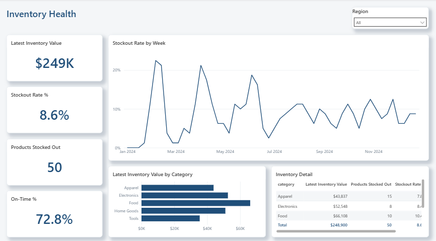
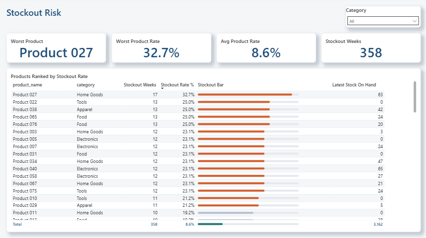
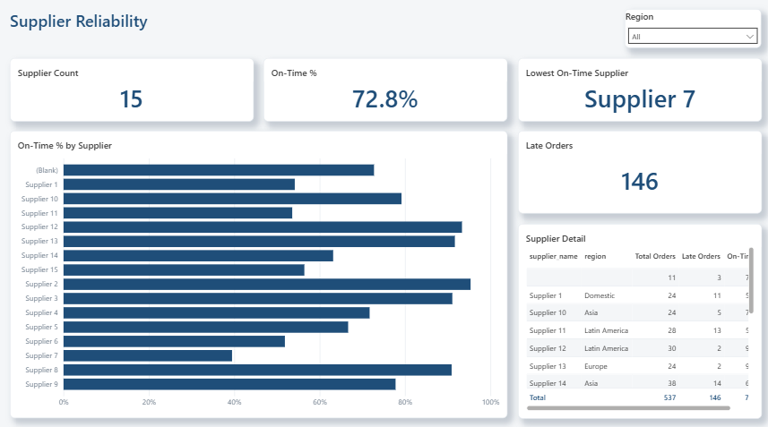

# Supply Chain & Inventory Optimization - Power BI

Three-page dashboard built from the SQLite tables in [SQL](../sql) and the clean CSVs in [Python](../python). It shares the portfolio palette and grid with the other dashboards, but each page is laid out around the question it answers rather than reusing one template.

## Tools

- Power BI Desktop
- Power Query
- DAX measures

## Pages

**Inventory Health**



KPIs run down a vertical rail on the left so the 52-week stockout timeline gets the full height of the page. The question here is what happened over the year, so time gets the space. Below it, inventory value by category and a category-level detail table.

Stockout rate averages 8.6% across the year, but the timeline shows it is not steady: it spikes above 20% three times before settling into a tighter band from July onward.

**Stockout Risk**



No chart on this page. With 80 products, a bar chart is unreadable, so the ranked table is the visual: each row carries an inline bullet bar drawn by a DAX measure that returns SVG, scaled against a fixed 35% ceiling so bars stay comparable between rows and coloured by risk band.

Product 027 tops the list at 32.7% - stocked out 17 of 52 weeks. The pattern worth noting is that several of the worst offenders sit at exactly 25.0% and 23.1%, which is what a reorder point set too low looks like when demand is steady.

**Supplier Reliability**



Asymmetric layout: a tall comparison of on-time delivery across suppliers on the left, sorted worst first, with late-order volume and a supplier table on the right.

On-time rates run from 39.5% to over 90%. A single "average lead time" number would hide that spread completely, which is the point of ranking suppliers individually.

## Design

Canvas is `1280 x 720`, 24px page margin, 16px gutters, and a 64px header band on every page. Rows close exactly on the canvas.

| Role | Hex |
| --- | --- |
| Accent | `#1F4E79` |
| Good | `#2B7A78` |
| Bad | `#D4602E` |
| Neutral | `#B9C3CF` |
| Page background | `#F4F6F8` |
| Card border | `#E6EAEF` |

Container styling lives in the report theme (`SupplyChainInventory.Report/StaticResources/RegisteredResources/IndustrialPremium.json`) rather than on individual visuals, so the report re-themes from one file.

## Data Quality

Eleven purchase orders arrived with no supplier on record. Rather than dropping them or letting Power BI render them as a nameless blank, the model assigns them to an explicit unknown member: Power Query maps the null key to `-1` and the supplier dimension carries a matching row named "No supplier on record". The orders stay in the totals and the gap stays visible instead of quietly disappearing.

## Data Model

`inventory_snapshots` and `purchase_orders` are separate fact tables at different grains and are never joined directly; `products` and `suppliers` are the shared dimensions:

- `products[product_id]` 1:* `inventory_snapshots[product_id]`
- `products[product_id]` 1:* `purchase_orders[product_id]`
- `suppliers[supplier_id]` 1:* `purchase_orders[supplier_id]`

## Measures

Inventory value is a stock, not a flow. Summing every weekly snapshot would count the same warehouse 52 times, so the KPI resolves the latest snapshot first:

```DAX
Inventory Value =
SUMX(
    inventory_snapshots,
    inventory_snapshots[stock_on_hand] * RELATED(products[unit_cost])
)

Latest Inventory Value =
VAR LatestDate = [Latest Snapshot Date]
RETURN CALCULATE([Inventory Value], inventory_snapshots[snapshot_date] = LatestDate)
```

The supplier measures exclude the unknown member (`supplier_id = -1`) explicitly. Those eleven orders belong in order totals but must not inflate the supplier count or be scored for on-time delivery, since no supplier was ever recorded for them:

```DAX
Supplier Count = CALCULATE(DISTINCTCOUNT(suppliers[supplier_id]), suppliers[supplier_id] <> -1)

Lowest On-Time Supplier =
CONCATENATEX(
    TOPN(1, CALCULATETABLE(VALUES(suppliers[supplier_name]), suppliers[supplier_id] <> -1), [On-Time %], ASC),
    suppliers[supplier_name], ", "
)
```

The bullet bars in the Stockout Risk table are drawn by a measure that returns SVG and is tagged `dataCategory: ImageUrl`:

```DAX
Stockout Bar =
VAR Rate  = [Stockout Rate %]
VAR Scale = 0.35
VAR BarW  = 300
VAR W     = MAX(1, MIN(BarW, DIVIDE(Rate, Scale) * BarW))
VAR Fill  = IF(Rate >= 0.20, "#D4602E", IF(Rate >= 0.10, "#B9C3CF", "#2B7A78"))
RETURN
    "data:image/svg+xml;utf8," &
    "<svg xmlns='http://www.w3.org/2000/svg' width='" & BarW & "' height='18'>" &
    "<rect x='0' y='6' width='" & BarW & "' height='6' rx='3' fill='#E6EAEF'/>" &
    "<rect x='0' y='6' width='" & FORMAT(W, "0") & "' height='6' rx='3' fill='" & Fill & "'/>" &
    "</svg>"
```

The scale is a fixed 35% ceiling rather than the row maximum, so bars stay comparable when the table is filtered.

## Project files

- `SupplyChainInventory.pbip` opens the report in Power BI Desktop.
- `SupplyChainInventory.Report/` holds the PBIR pages, visuals and theme.
- `SupplyChainInventory.SemanticModel/` holds the TMDL model: table definitions, relationships and measures.

The PBIP folder is the source of truth; `supply_chain_inventory.pbix` is exported from it as a single downloadable file.

## Known Limitation

`products` has a `supplier_id` column but no relationship to `suppliers`; the only path runs through `purchase_orders`, which is a fact table and does not propagate filters onward. Region therefore cannot filter inventory or stockout measures, which is why Inventory Health filters by category instead. Resolving it means choosing which supplier relationship is authoritative, since a direct `products` to `suppliers` link would make the path ambiguous.

## How to run

Open `supply_chain_inventory_pbip/SupplyChainInventory.pbip` in Power BI Desktop. Set the `DataFolder` parameter to the absolute path of `supply_chain_inventory/python/data/processed/` in your clone, then refresh: a PBIP stores model metadata only, so the tables are empty until the first refresh reads the CSVs.
