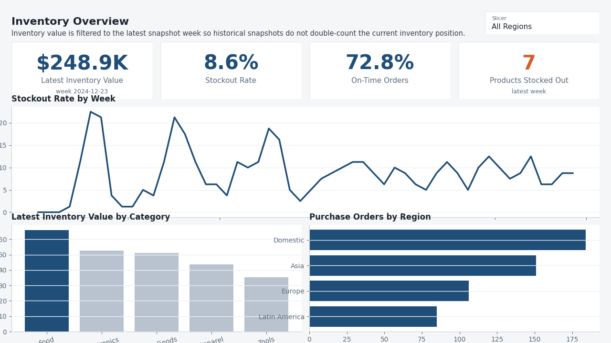
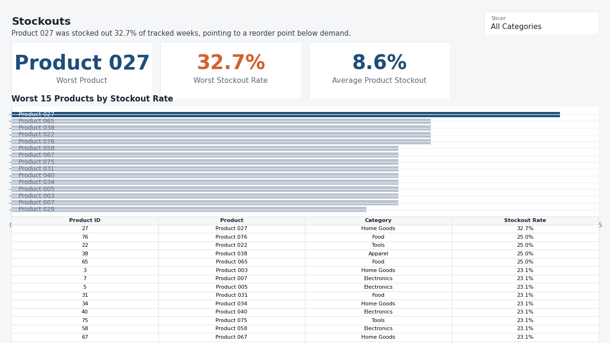
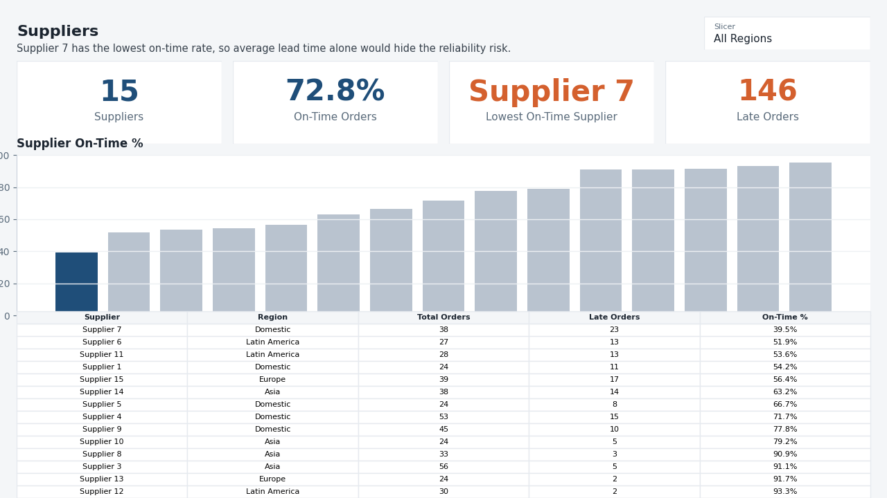

# Supply Chain & Inventory Optimization - Power BI

Dashboard design built from the SQLite database used by the [SQL analysis](../sql), using the same portfolio design system as the Wastewater Effluent Quality dashboard: header band, single blue accent, neutral supporting visuals, KPI cards at the top, and one written finding per page.

## Tools

- Power BI Desktop
- SQLite / ODBC import
- DAX measures

## Pages

**Inventory Overview**



Latest inventory value, stockout rate, on-time order KPIs, and current products stocked out, plus stockout trend, latest inventory value by category, and purchase-order volume by supplier region.

**Stockouts**



Worst-product cards compare the riskiest SKU against the average product stockout rate, followed by a ranked product chart and a detail table with weeks stocked out, stockout rate, and latest stock on hand.

**Suppliers**



Supplier count, on-time performance, lowest on-time supplier, late orders, supplier on-time delivery chart, and a detail table. The page is sorted worst first so unreliable suppliers are visible immediately.

## Power BI Build Notes

The editable Power BI project is in [supply_chain_inventory_pbip](./supply_chain_inventory_pbip):

- `SupplyChainInventory.pbip` opens the report in Power BI Desktop.
- `SupplyChainInventory.Report/` contains the PBIR report pages and visuals.
- `SupplyChainInventory.SemanticModel/` contains the local TMDL semantic model, CSV imports, relationships, and measures.

The model, DAX, page map, and formatting rules are documented in [dashboard_spec.md](./dashboard_spec.md). The project can be rebuilt with:

```powershell
python tools\generate_powerbi_pbip_projects.py
```

## How to run

Open `supply_chain_inventory/powerbi/supply_chain_inventory_pbip/SupplyChainInventory.pbip` in Power BI Desktop.

To create a single-file `.pbix`, use Power BI Desktop: **File > Save As > Power BI report (.pbix)** and save it as `supply_chain_inventory.pbix`. The CLI-generated PBIP is committed because `pbir` cannot embed a local `.SemanticModel` into a `.pbix` binary without Power BI Desktop.

## Project Status

Done
