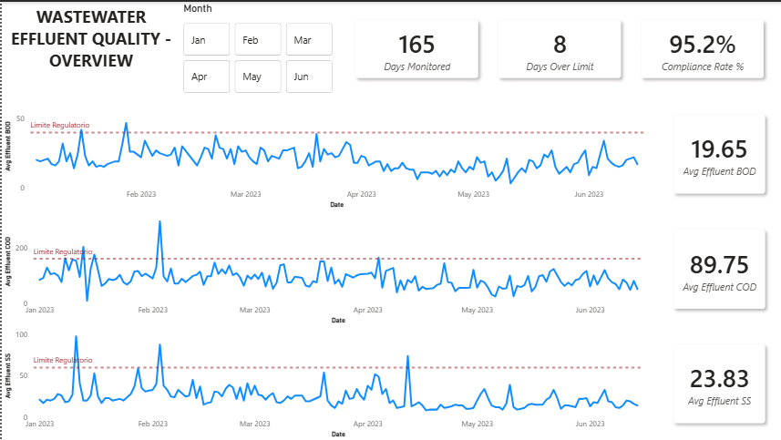
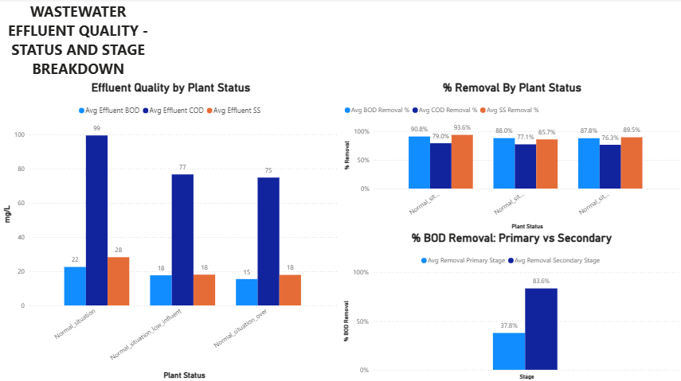

# Wastewater Effluent Quality - Power BI

Dashboard built on top of the cleaned dataset from [Python](../python), the same data queried in [SQL](../sql). Two pages: one for the overall picture, one for the stage-by-stage breakdown.

## Tools

- Power BI Desktop
- Power Query
- DAX (basic measures)

## Pages

**Overview**

KPI cards for days monitored, days over the reference limit, and overall compliance rate, plus a month slicer and a trend line for effluent BOD, COD and SS against the reference limit ("Limite Regulatorio").

**Status and Stage Breakdown**

Effluent quality and removal % broken down by plant operating status, plus the primary-vs-secondary BOD removal comparison (37.8% vs 83.6%) - the same finding from the SQL analysis, now as a chart instead of just a number.

## How to run

Open `wastewater_effluent_quality.pbix` in Power BI Desktop. The data source is the cleaned CSV from [python](../python) (`data/processed/water_treatment_clean.csv`); if the path changes, update it in Power Query (Transform Data).

## Project Status

🟢 Done
